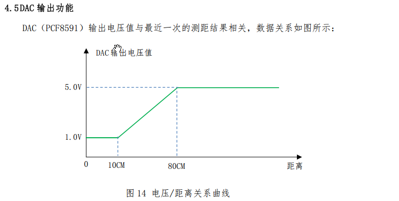

# 综合练习

##SMG功能

定义三个主界面，分别是数据界面、数据记录界面、参数界面。

#### 数据界面

数据界面分为5个子界面，分别是时间界面、温度界面、光照电压界面、频率界面、超声波测距界面。

**细节**

- 时间界面时分秒之间用间隔符隔开
- 温度界面提示符为C，温度值保留小数点后一位。
- 光照电压界面标识符为E，采集的电压值保留小数点后一位，最后一位表示亮灭（1-亮）
- 频率界面标识符为F，使用6位数码管表示，数据不足6位时高位数码管熄灭。
- 测距界面标识符为L，最后两位表示测距值数据不足2位时高位数码管熄灭，最大为99。

#### 数据记录界面

数据记录界面分为3个子界面，分别表示捕获的温度最大值、平均值、最小值。

**细节**

#### 参数界面

参数界面分为3个子界面，分别表示温度参数、距离参数、参数变动次数。

**细节**

- 第一个子参数界面标识为P1，最后两位显示温度参数。
- 第二个子参数界面标识为P2，最后两位显示距离参数。
- 第三个子参数界面标识为P3，最后两位显示参数变动次数。

## 按键功能

- S4-界面切换按键

- S5-子界面切换按键

- S8-（短按:按下未超过1s弹起触发）参数加按键

  在温度参数界面，按下温度参数加2。范围：0~99

  在距离参数界面，按下距离参数加5。范围：0~99

- S8-（长按:按下超过1s触发）DAC开启与关闭切换按键

  切换DAC的关闭与输出状态。

- S9-（短按:按下未超过1s弹起触发）参数减按键

  在温度参数界面，按下温度参数减2。范围：0~99

  在距离参数界面，按下距离参数减5。范围：0~99

- S9-（长按:按下超过1s触发）清除按键

  清除温度最大值、最小值、平均值。

  清除存储在0X00位置的参数变动次数。
  
  

**要求**

做好消抖处理，避免一次按下多次触发。

长、短按注意区分。

按键仅在规定界面下可以触发相关功能，否则无效。

==设置的参数在退出参数界面后生效。==

每次进入数据界面默认显示时间数据、每次进入数据记录界面默认显示最大值、每次进入参数界面默认显示温度参数。

## 主体功能

### 触发捕获温度功能

采集的光照电压值大于2V，则判定环境为"亮"状态，否则为"暗"状态。

由"亮"状态到"暗"状态触发一次温度捕获功能。

每一次捕获的温度值，通过比较得出最大值和最小值，并计算平均值。

### EEPROM存取功能

（从参数界面退出，切换回数据界面）如果参数变动，则变动次数加1，将变动次数保存在EEPROM的0X00地址中。上电读取变动次数。

###串口功能

接收到T指令，返回温度数据

接收到D指令，返回距离数据

接收到R指令，返回AD采集电压数据

否则，返回Error。

### LED功能

- 位于数据界面L1亮，否则熄灭。
- 位于数据记录界面L2亮，否则熄灭。
- 位于参数界面L3亮，否则熄灭。
- 如果实时温度大于温度参数则L4亮，否则熄灭。
- 如果测量距离大于距离参数则L5亮，否则熄灭。
- 采集温度状态触发L6点亮3s
- S8长按状态触发L7点亮3s
- S9长按状态触发L8点亮3s

### DAC输出功能

开启状态下，DAC输出与测量距离成比例关系。

关闭状态下，固定输出5V。

### 初始状态说明

- DAC处于启动状态
- 上电后数码管处于数据界面，显示时间。
- 时间为20h 59min 50s
- 温度参数：30°C
- 距离参数：35cm
